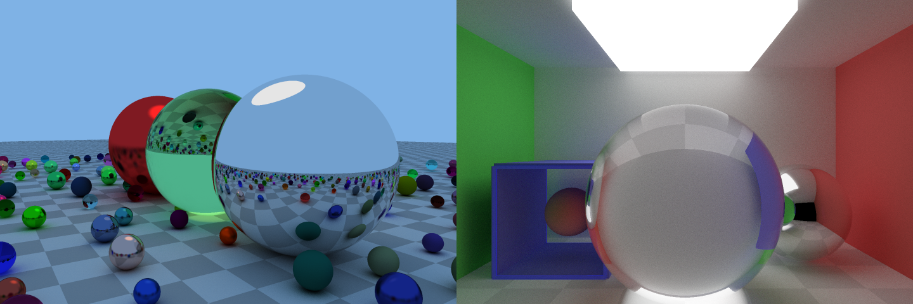

# Ray Tracer

A toy ray tracer for educational purposes (i.e. my own education).

- Written from scratch in Rust
- Most of the theory from Peter Shirley's [Ray Tracing in One Weekend](https://github.com/petershirley/raytracinginoneweekend) and [Ray Tracing the Next Week](https://github.com/petershirley/raytracingthenextweek)

## Demo
[](https://alesgenova.github.io/ray-tracer-app)

## Features

- Geometries:
  - Sphere
  - Rectangle
  - Cube
- Transformations:
  - Translation
  - Rotations (TODO)
  - Scale (TODO)
  - Sheer (TODO)
- Materials:
  - Lambertian
  - Metal
  - Dielectric
  - Emitting
- Textures:
  - Uniform
  - Checker
  - Gradient (TODO)
  - Image (TODO)
  - Perlin (TODO)
- Cameras:
  - Perspective
  - Orthographic (TODO)
- Ray / Actor hit search
  - Linear
  - Binary Tree
  - Octree

## Usage
```rust
use ray_tracer::vector::Vec3;
use ray_tracer::scene::Scene;
use ray_tracer::hitable::primitive::Sphere;
use ray_tracer::hitable::primitive::Rectangle;
use ray_tracer::hitable::transform::Translation;
use ray_tracer::camera::perspective::PerspectiveCamera;
use ray_tracer::renderer::Renderer;
use ray_tracer::material::Material;
use ray_tracer::material::plain::PlainMaterial;
use ray_tracer::material::lambertian::LambertianMaterial;
use ray_tracer::material::metal::MetalMaterial;
use ray_tracer::actor::Actor;
use ray_tracer::texture::uniform::UniformTexture;
use ray_tracer::constants::Axis;

let mut scene = Scene::<f64>::new();
scene.set_background(Vec3::from_array([0.2, 0.2, 0.2]));

// The floor
let hitable = Box::new(Rectangle::new(100.0, Axis::X, 100.0, Axis::Y));
let texture = Box::new(UniformTexture::new(Vec3::from_array([0.8, 0.8, 0.8])));
let material = Box::new(LambertianMaterial::new(texture, 0.65));
let actor = Actor { hitable, material};
scene.add_actor(actor);

// A sphere
let hitable = Box::new(Sphere::new(1.5));
let hitable = Box::new(Translation::new(hitable, Vec3::from_array([0.0, 0.0, 1.5])));
let texture = Box::new(UniformTexture::new(Vec3::from_array([1.0, 0.2, 0.2])));
let material = Box::new(MetalMaterial::new(texture, 0.0));
let actor = Actor { hitable, material};
scene.add_actor(actor);

// A light
let hitable = Box::new(Sphere::new(2.5));
let hitable = Box::new(Translation::new(hitable, Vec3::from_array([0.0, -2.0, 12.5])));
let texture = Box::new(UniformTexture::new(Vec3::from_array([1.0, 1.0, 1.0])));
let material = Box::new(PlainMaterial::new(texture));
let actor = Actor { hitable, material};
scene.add_actor(actor);


// Set up the camera
let width = 320;
let height = 180;
let aspect = width as f64 / height as f64;

let mut camera = PerspectiveCamera::<f64>::new();
camera.set_fov(0.37 * std::f64::consts::PI);
camera.set_position(&[0.0, - 4.0, 1.5]);
// camera.set_direction(&[0.0, 1.0, 0.0]);
camera.set_lookat(&[0.0, 0.0, 1.5]);
camera.set_up(&[0.0, 0.0, 1.0]);
camera.set_fov(0.35 * std::f64::consts::PI);

// Set up the renderer
let samples = 256;
let max_reflections = 8;
let antialiasing = false
let renderer = Renderer::new(width, height, samples, max_reflections, antialiasing);

// Process the image
let image = renderer.render(&scene, &camera);
```
